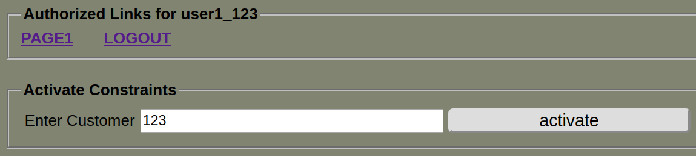
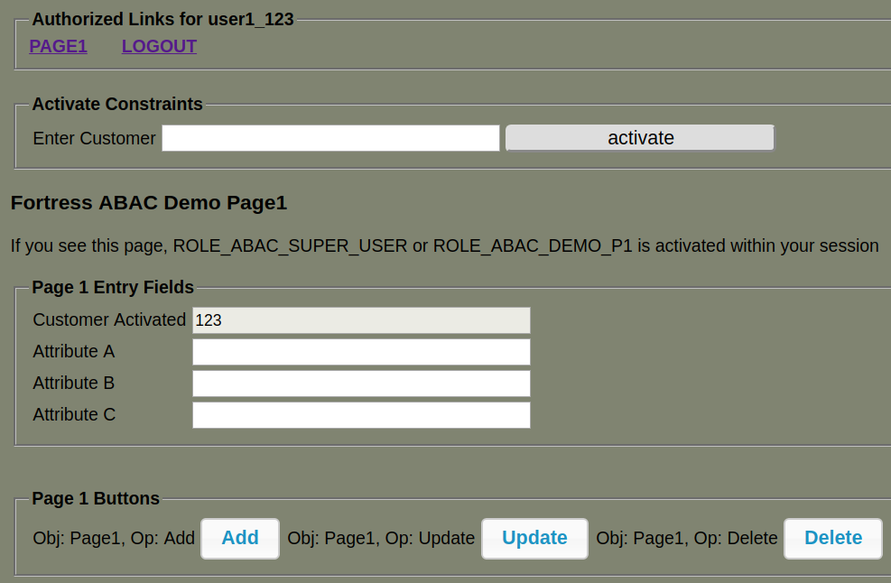
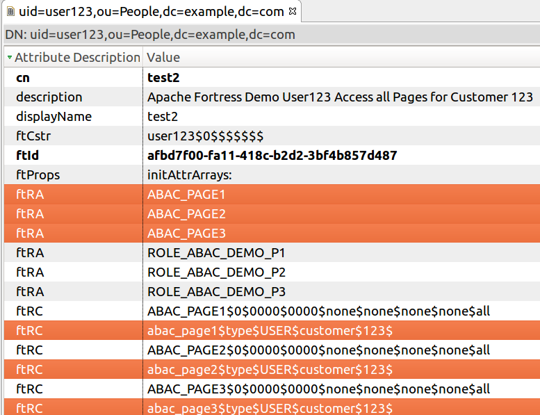

© 2025 iamfortress.net
# Overview of the fortress-abac-demo README

 * This document demonstrates how to build and deploy the fortress abac sample.
 * The intent is to demonstrate using attributes to control role activation within an Apache Wicket Web app.
 * For more info about the idea: [Towards an Attribute-Based Role-Based Access Control System](https://iamfortress.net/2018/07/07/towards-an-attribute-based-role-based-access-control-system/)

-------------------------------------------------------------------------------
## Table of Contents
 * SECTION 1. Prerequisites
 * SECTION 2. Prepare Tomcat for Java EE Security
 * SECTION 3. Prepare package
 * SECTION 4. Build and deploy sample
 * SECTION 5. Understand the security policy
 * SECTION 6. Manually Test the sample
 * SECTION 7. Automatically Test the sample (using Selenium)
 * SECTION 8. Under the Hood (Learn how it works here)

-------------------------------------------------------------------------------
## SECTION I. Prerequisites
1. Java >= 17
2. Apache Maven >= 3
3. Apache Tomcat >= 11
4. Basic LDAP server setup by completing one of these:
    * [OpenLDAP & Fortress QUICKSTART](https://github.com/apache/directory-fortress-core/blob/master/README-QUICKSTART-SLAPD.md)
    * [OpenLDAP & Fortress QUICKSTART on DOCKER](https://github.com/apache/directory-fortress-core/blob/master/README-QUICKSTART-DOCKER-SLAPD.md)
    * [APACHEDS & Fortress QUICKSTART](https://github.com/apache/directory-fortress-core/blob/master/README-QUICKSTART-APACHEDS.md)    
    * [APACHEDS & Fortress QUICKSTART on DOCKER](https://github.com/apache/directory-fortress-core/blob/master/README-QUICKSTART-DOCKER-APACHEDS.md)
    * [ansible-apache-fortress](https://gitlab.symas.net/symas-public/ansible-apache-fortress)

-------------------------------------------------------------------------------
## SECTION II. Prepare Tomcat for Java EE Security

This sample web app uses Java EE security.

#### 1. Download the fortress realm proxy jar into tomcat/lib folder:

  ```bash
  wget https://repo.maven.apache.org/maven2/org/apache/directory/fortress/fortress-realm-proxy/[version]/fortress-realm-proxy-[version].jar -P $TOMCAT_HOME/lib
  ```

 * Where `$TOMCAT_HOME` points to the execution env.

 Note: The realm proxy enables Tomcat container-managed security functions to call back to fortress.

#### 2. Optional - Prepare tomcat to allow autodeploy of fortress-abac-demo web app:

 ```bash
 sudo vi /usr/local/tomcat8/conf/tomcat-users.xml
 ```

#### 3. Optional - Add tomcat user to deploy fortress-abac-demo:

 ```xml
 <role rolename="manager-script"/>
 <user username="tcmanager" password="m@nager123" roles="manager-script"/>
 ```

#### 4. Restart tomcat for new settings to take effect.

-------------------------------------------------------------------------------
## SECTION III. Prepare package

#### 1. Stage the project.

 a. Download and extract from Github:

 ```bash
 wget https://github.com/shawnmckinney/fortress-abac-demo/archive/master.zip
 ```

 -- Or --

 b. Or `git clone` locally:

 ```git
 git clone https://github.com/shawnmckinney/fortress-abac-demo.git
 ```

#### 2. Change directory into it:

 ```bash
 cd fortress-abac-demo
 ```

#### 3. Enable an LDAP server:

 a. Copy the example:

 ```bash
 cp src/main/resources/fortress.properties.example src/main/resources/fortress.properties
 ```

 b. Edit the file:

 ```bash
 vi src/main/resources/fortress.properties
 ```

 Pick either Apache Directory or OpenLDAP server:

 c. Prepare fortress for ApacheDS usage:

 ```properties
 # This param tells fortress what type of ldap server in use:
 ldap.server.type=apacheds

 # Use value from [Set Hostname Entry]:
 host=localhost

 # ApacheDS defaults to this:
 port=10389

 # These credentials are used for read/write access to all nodes under suffix:
 admin.user=uid=admin,ou=system
 admin.pw=secret
 ```

 -- Or --

 d. Prepare fortress for OpenLDAP usage:

 ```properties
 # This param tells fortress what type of ldap server in use:
 ldap.server.type=openldap

 # Use value from [Set Hostname Entry]:
 host=localhost

 # OpenLDAP defaults to this:
 port=389

 # These credentials are used for read/write access to all nodes under suffix:
 admin.user=cn=Manager,dc=example,dc=com
 admin.pw=secret
 ```

-------------------------------------------------------------------------------
## SECTION IV. Build and deploy sample

#### 1. Verify the java and maven home env variables are set.

```maven
mvn -version
```

 This sample requires Java >= 11 and Maven >= 3 to be setup within the execution env.

#### 2. Build the sample and load test data:

```maven
mvn install -Dload.file
```

 Build Notes:
 * `-Dload.file` automatically loads the [fortress-abac-demo-load-policy.xml](src/main/resources/fortress-abac-demo-load-policy.xml) data into ldap.
 * This load needs to happen just once for the default test cases to work and may be dropped from future `mvn` commands.

#### 3. Deploy the sample to Tomcat:

 a. If using autodeploy feature, verify the Tomcat auto-deploy options are set correctly in the [pom.xml](pom.xml) file:
 ```xml
 <plugin>
     <groupId>org.codehaus.mojo</groupId>
     <artifactId>tomcat-maven-plugin</artifactId>
     <version>1.0-beta-1</version>
     <configuration>
     ...
         <url>http://localhost:8080/manager/text</url>
         <path>/${project.artifactId}</path>
         <username>tcmanager</username>
         <password>m@nager123</password>
     </configuration>
 </plugin>
 ```

 b. Now, automatically deploy to tomcat server:

  ```maven
 mvn clean tomcat:deploy
  ```

 c. To automatically redeploy sample app:

  ```maven
 mvn clean tomcat:redeploy
  ```

 d. To manually deploy app to Tomcat:

 ```bash
 cp target/fortress-abac-demo.war $TOMCAT_HOME/webapps
 ```

 * Where `$TOMCAT_HOME` points to the execution env.

-------------------------------------------------------------------------------
## SECTION V. Understand the security policy

To gain full understanding, check out the file used to load it into the LDAP directory: [fortress-abac-demo-load-policy.xml](src/main/resources/fortress-abac-demo-load-policy.xml).

#### 1. User-to-Role Assignment Table

 For this app, user-to-role assignments are:

| user        | Page1       | Page2    | Page3    |
| ----------- | ----------- | -------- | -------- |
| apoweruser  | true        | true     | true     |
| auser123    | true        | true     | true     |
| auser456    | true        | true     | true     |
| auser789    | true        | true     | true     |
| auser1      | true        | false    | false    |
| auser1_123  | true        | false    | false    |
| auser1_456  | false       | true     | false    |
| auser1_789  | false       | false    | true     |
| auser2      | false       | true     | false    |
| auser2_123  | true        | false    | false    |
| auser2_456  | false       | true     | false    |
| auser2_789  | false       | false    | true     |
| auser3      | false       | false    | true     |
| auser3_123  | true        | false    | false    |
| auser3_456  | false       | true     | false    |
| auser3_789  | false       | false    | true     |


#### 2. User-to-Role Activation Table by Branch

 But we want to control role activation using attributes based on Customer number:

| user        | Page1       | Page2       | Page3       |
| ----------- | ----------- | ----------- | ----------- |
| apoweruser  | 123,456,789 | 123,456,789 | 123,456,789 |
| auser123    | 123         | 123         | 123         |
| auser456    | 456         | 456         | 456         |
| auser789    | 789         | 789         | 789         |
| auser1      | 123,456,789 |             |             |
| auser1_123  | 123         |             |             |
| auser1_456  | 456         |             |             |
| auser1_789  | 789         |             |             |
| auser2      |             | 123,456,789 |             |
| auser2_123  |             | 123         |             |
| auser2_456  |             | 456         |             |
| auser2_789  |             | 789         |             |
| auser3      |             |             | 123,456,789 |
| auser3_123  |             |             | 123         |
| auser3_456  |             |             | 456         |
| auser3_789  |             |             | 789         |


## SECTION VI. Manually Test the sample

#### 1. Open link to [http://localhost:8080/fortress-abac-demo](http://localhost:8080/fortress-abac-demo)

#### 2. Login with Java EE authentication form:

#### 3. User-Password Table

 Password = 'password' for all:

 | userId         | Password      |
 | -------------- | ------------- |
 | auser1         | password      |
 | auser1_123     | password      |
 | auser1_456     | password      |
 | auser1_789     | password      |
 | auser2         | password      |
 | auser3         | password      |
 | ...            | password      |


#### 4. Click on a page link.

#### 5. Enter a customer number for user and click on the button.

 ```
 Enter 123, 456, or 789
 ```

 

#### 6. Once the location is set, buttons appear simulating user access for that particular customer.

 

#### 7. Try a different user.

 Each has different access rights to application based on their constraints.

## SECTION VII. Automatically Test the sample

 * Work-in-progress....

 Run the selenium automated test:

 ```maven
 mvn test -Dtest=ApacheFortressDemoSeleniumITCase
 ```

 Selenium Test Notes:
 * *This test will log in as each user, perform positive and negative test cases.*
 * *Requires Firefox on target machine.*

-------------------------------------------------------------------------------
## SECTION VIII. Under the Hood

 How does this work?  Have a look at some code...

 Paraphrased from [MyBasePage.java](src/main/java/com/abac/MyBasePage.java):

 Every time a constraint is activated, some code executes like this....

 ```java
// Nothing new here:
User user = new User(userId);

// This is new:
RoleConstraint constraint = new RoleConstraint( );

// In practice we're not gonna pass hard-coded key-values in here, but you get the idea:
constraint.setKey( "customer" );
constraint.setValue( "123" );

// This is just boilerplate:
List<RoleConstraint> constraints = new ArrayList();
constraints.add( constraint );

try
{
  // Now, create the RBAC session with an ABAC constraint, customer=123, asserted:
  Session session = accessMgr.createSession( user, constraints );
  ...
}
```

 Pushing the **customer** attribute into the User's RBAC session the runtime will match that instance data with their stored policy.

 

 *Notice that this user has been assigned Page1, Page2 and Page3 roles, via **ftRA** attribute, and that another attribute, **ftRC**, constrains which customer it can be activated.*

### How the ABAC algorithm works:
 * When the runtime iterates over assigned roles (ftRA), trying to activate them one-by-one, it matches the constraint pushed in, e.g. customer=123, with its associated role constraint (ftRC).
 * If it finds a match, the role can be activated into the session, otherwise not.

### When does it get executed:
 * During the [createSession](https://directory.apache.org/fortress/gen-docs/latest/apidocs/org/apache/directory/fortress/core/AccessMgr.html#createSession-org.apache.directory.fortress.core.model.User-boolean-) call, there's a role activation phase, where all of the constraints are applied.
 * Applying constraints is not a new concept with Fortress, check out, [What Are Temporal Constraints?](https://iamfortress.net/2015/06/11/what-are-temporal-constraints/), for more info.
 * Constraints are enabled via [fortress' configuration subsystem](https://github.com/apache/directory-fortress-core/blob/master/README-CONFIG.md).  Currently ABAC and temporal constraints are turned on by default.

For example, user-role constraint enabled via the fortress.propeties file:

```properties
...
# Enable the ABAC constraint validator:
temporal.validator.5:org.apache.directory.fortress.core.util.time.UserRoleConstraint
```

### One more thing:
 * ABAC constraints work with any kind of instance data, e.g. account, organization, etc.  Let your imagination set the boundaries.
